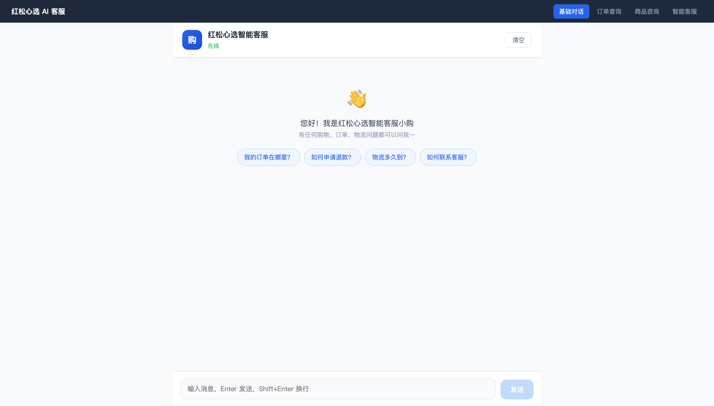
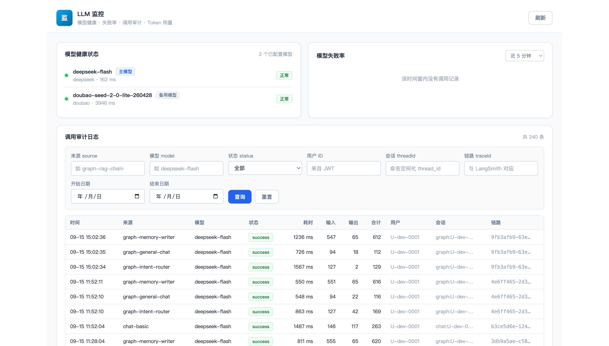
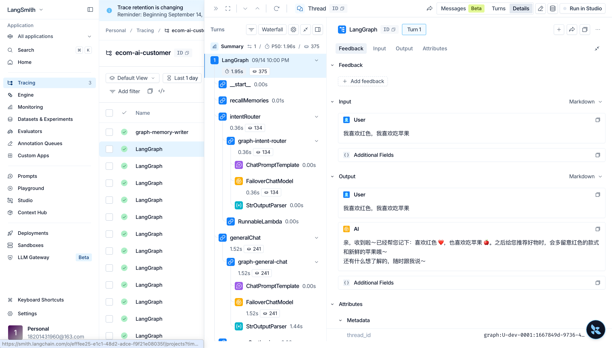

# 红松心选 AI 客服系统

基于 Vue 3 + NestJS + LangChain/LangGraph 构建的全栈智能客服系统，支持流式对话、Agent 调用、混合检索 RAG 与完整的质量评估体系。

## 运行效果



## 项目结构

```
ecom-ai-customer/
├── client/          # 客服前台（Vue 3 + Vite）
├── monitor/         # LLM 监控台（独立 Vue 3 + Vite 应用，可单独部署）
└── server/          # 后端（NestJS + LangChain + LangGraph + PostgreSQL）
```

## 功能特性

- 💬 **流式对话** — 基于大模型的实时智能客服对话（SSE 流式输出）
- 🤖 **Agent 智能体** — 支持工具调用的多轮对话 Agent（订单查询等）
- 📚 **混合检索 RAG** — 向量检索 + BM25 关键词检索 + RRF 融合，召回更精准
- 🔄 **增量更新** — 知识库默认增量入库，只处理有变更的文件，高效维护
- 🧠 **三层记忆机制** — 短期记忆（Checkpointer）+ 长期记忆（用户偏好跨会话）+ 摘要压缩（LLM 压缩旧对话）
- 🧩 **LangGraph 工作流** — 意图路由 + 多节点编排的复杂对话流程
- ⚖️ **RAG 质量评估体系** — 召回率 / 准确率 / 生成质量三维度评估，LLM-as-Judge 自动打分
- 📑 **参考来源展示** — 前端展示回答依据的知识库来源，按文档去重

## 快速开始

### 后端

#### 1. 安装依赖 & 配置环境变量

```bash
cd server
cp .env.example .env   # 配置 API Key、数据库连接等环境变量
pnpm install
```

#### 2. 初始化数据库（首次启动必做）

> 确保本地 PostgreSQL 已启动，并且已安装 [pgvector](https://github.com/pgvector/pgvector) 扩展。

```bash
pnpm run init-db
```

该脚本会自动完成（幂等，可重复执行）：
- 创建目标数据库（默认 `ecom_ai`，可在 `.env` 中通过 `PG_DATABASE` 修改）
- 启用 `pgvector` 扩展（向量检索）与 `pg_trgm` 扩展（字符模糊匹配索引，当前关键词路已改用 BM25，索引保留）
- 创建 `knowledge_embeddings` 向量表，含 HNSW 向量索引、GIN 关键词索引、全文检索索引
- 创建 LangGraph 记忆表：`checkpoints` / `checkpoint_blobs` / `checkpoint_writes`（短期记忆）与 `store` / `store_vectors`（长期记忆）

#### 3. 入库知识库（使用 RAG 功能前必做）

```bash
pnpm run ingest           # 增量更新（默认，只处理有变更的文件）
pnpm run ingest --full    # 全量更新（清空后重新写入所有文档）
```

该脚本会自动扫描 `server/src/data/knowledge/` 下所有 `.md` 文件，切分后写入向量数据库。
增量更新原理：对比文件 mtime 与数据库中 `last_ingested_at`，只处理新增/修改/删除的文件。

#### 4. 启动服务

```bash
pnpm run dev
```

服务启动后访问 http://localhost:3000

### 前端（客服前台）

```bash
cd client
pnpm install
pnpm run dev
```

访问 http://localhost:5173

### LLM 监控台（独立前端）

LLM 监控台已从客服前台抽离为独立应用，单独端口（默认 5175）、可独立部署：

```bash
cd monitor
pnpm install
pnpm run dev
```

访问 http://localhost:5175

> 监控台通过 `GET /api/llm/*` 读取数据，请求封装（含开发态 token）在 `monitor/src/utils/request.ts`，与客服前台各自独立。

运行效果：



## 技术栈

- **前端**: Vue 3、Vue Router、Vite、TypeScript
- **后端**: NestJS、LangChain、LangGraph、PostgreSQL + pgvector + pg_trgm
- **AI**: OpenAI 兼容接口大模型（DeepSeek 等）
- **可观测性**: LangSmith 链路追踪 + 自建审计日志（`llm_audit_logs`）
- **包管理器**: pnpm

## LangSmith 链路追踪

系统接入 [LangSmith](https://www.langchain.com/langsmith) 做 LLM 调用链路的可视化追踪，配合自建的审计日志（`llm_audit_logs` 表）形成完整的可观测性体系。

### 启用方式

在 `server/.env` 配置三个环境变量即可（LangChain core 检测到 `LANGSMITH_TRACING=true` 会自动全局启用追踪）：

```bash
LANGSMITH_TRACING=true        # 是否启用 LangSmith 监控
LANGSMITH_API_KEY=...         # LangSmith 的 API Key
LANGSMITH_PROJECT=...         # 项目名称，WebUI 按此筛选运行记录
```

### 工作原理

- LangSmith 以**回调处理器**的形式注入 LangChain 回调系统：每次模型/链/图执行时，run 树（prompt、输出、token、耗时）异步上报
- 同一请求内通过 `parentRunId` 把嵌套调用串成一棵 **trace 树**（意图路由 → 各节点 → 模型调用）
- 追踪是**异步**的，不阻塞用户请求主流程

### 与自建审计日志对齐

项目用统一的 [buildTraceConfig](server/src/llm/trace-context.ts) 生成追踪配置，一份配置两个用途：

| 字段 | 读取方 | 用途 |
|---|---|---|
| 顶层 `source/traceId/userId/threadId` | 自定义模型 `FailoverChatModel.extractMetadata` | 写审计日志（`llm_audit_logs`） |
| `metadata`（同字段） | LangSmith 回调系统 | WebUI 按用户/会话筛选 trace |
| `runName = source` | LangSmith | run 名称 = 审计的 `source`，两边可互查 |

每次用户请求生成唯一 `traceId`，全链路节点共享，因此审计日志与 LangSmith trace 可通过同一 `traceId` 关联排查。

### 效果图



## 前端页面

### 客服前台（client，http://localhost:5173）

| 路由 | 页面 | 功能 |
|---|---|---|
| `/` | 基础对话 | 纯大模型对话，验证基础链路 |
| `/agent` | Agent 订单查询 | 工具调用 Agent，支持订单查询等工具 |
| `/rag` | 商品咨询 | RAG 知识库问答，带参考来源展示（按文档去重） |
| `/graph` | 智能客服 | 完整 LangGraph 工作流，含意图路由、记忆、RAG 等全部能力 |

### LLM 监控台（monitor，http://localhost:5175）

独立单页应用（不含路由），包含四个区块：

| 区块 | 数据来源 |
|---|---|
| 模型健康状态（主/备模型可用性与探测延迟） | `GET /api/llm/health` |
| 模型失败率（近 5 / 15 / 60 分钟） | `GET /api/llm/failure-rate` |
| 调用审计日志（来源 / 模型 / 状态 / 用户 / 会话 / 链路 / 时间范围过滤 + 分页） | `GET /api/llm/logs` |
| Token 用量统计（近 7 / 14 / 30 天） | `GET /api/llm/token-stats` |

## 混合检索 RAG

RAG 检索采用**向量 + 关键词双路召回 + RRF 融合**的混合检索方案：

```
用户问题
   ├── 向量检索（pgvector 余弦相似度）─────┐
   └── 关键词检索（BM25，bigram 分词）─────┤
                                           ├── RRF 融合（倒数排名融合）── Top-4 → LLM 生成
```

- **向量检索**：捕捉语义相似性，擅长同义表达、模糊查询
- **关键词检索**：Okapi BM25，中文用 bigram 分词（`退款流程` → `退款/款流/流程`），`k1=1.2`、`b=0.75`；擅长精确术语、专有名词
- **RRF 融合**：`score(doc) = Σ 1 / (RRF_K + rank_i)`，无需归一化两路分数
- 每路召回 `recallK = max(k*3, 10)` 条，融合后取 `top-k = 4` 条给 LLM
- 关键词检索失败自动降级为纯向量检索

> 关键词索引是**内存索引**：服务启动后首次查询时全量载入知识库构建一次，因此**重新入库后需要重启后端服务**才会生效。

## 知识库增量更新

增量更新脚本 (`src/scripts/ingest.ts`) 工作原理：

1. 扫描知识库目录下所有 `.md` 文件，记录每个文件的 `mtime`
2. 查询数据库中已入库文档的 `last_ingested_at`
3. 对比得出：**新增 / 修改 / 删除 / 无变更** 四类文件
4. 新增文件：切分写入；修改文件：先删旧 chunk 再写新 chunk；删除文件：移除所有 chunk
5. 无变更文件直接跳过

## 记忆机制（Graph 工作流）

Graph 链路实现了三层记忆，均在服务端管理，前端只传 `threadId`（会话）和 `userId`（用户）：

| 记忆类型 | 实现方式 | 存储 |
|---|---|---|
| **短期记忆** | LangGraph `PostgresSaver` Checkpointer，按 `thread_id` 隔离；对话历史持久化在服务端，重启/刷新不丢失 | `checkpoints` 等表 |
| **长期记忆** | LangGraph `PostgresStore`，按用户命名空间存储；每轮由 LLM 提取/更新用户偏好（称呼、颜色尺码偏好等），下轮召回注入 prompt | `store` / `store_vectors` 表 |
| **摘要压缩** | 消息数超过阈值（默认 10）时，由 LLM 把旧摘要与旧消息合并为新摘要，并用 `RemoveMessage` 从状态中删除被压缩的旧消息（保留最近 4 条） | 图状态 `summary` 字段 |

图结构（`server/src/graphs/customer-graph.ts`）：

```
START → recallMemories（召回长期记忆）
      → intentRouter（意图路由）
            ├─→ orderAgent（订单查询 Agent）
            ├─→ ragNode（RAG 检索 + 问题改写）
            └─→ generalChat（闲聊）
      → answerSynthesizer（生成最终回答）
      → [消息超阈值] summarize（LLM 压缩旧对话）
      → END
      → [异步副作用] memoryWriter（写入长期记忆，fire-and-forget 不阻塞响应）
```

> 长期记忆写入已从工作流图中移出，改为图执行后的异步副作用，避免阻塞用户收到最终答案。记忆召回仍在图内同步执行（后续节点依赖它）。

RAG 节点内部还会做**问题改写**：结合对话历史 + 长期记忆，把带指代/省略的问题改写成独立完整的检索问题，提升多轮对话下的检索准确率。

验证方式：
- 同一 `threadId` 连续请求（不带历史）可续接上下文 → 短期记忆生效
- `GET /api/graph/history?threadId=xxx` 查看服务端持久化的消息与摘要
- 换新 `threadId` 后仍记得用户偏好 → 长期记忆生效

## RAG 质量评估体系

项目内置完整的 RAG 质量评估工具，覆盖检索和生成两个层面：

### 1. 召回率评估（Recall@K）

```bash
pnpm run eval-recall -- --mode all       # 三种模式对比（推荐）
pnpm run eval-recall                     # 混合检索，默认 K=[1,3,5,10]
pnpm run eval-recall -- --mode vector    # 纯向量检索
pnpm run eval-recall -- --k 5            # 只评测指定 K 值
```

- 判断标准：**LLM 语义评估** top-K 结果能否回答问题（替代传统关键词匹配）
- 无答案问题：一条都没召回才算命中（检索不乱答）
- 支持按分类统计（商品查询 / 政策查询 / 无答案）

### 2. 准确率评估（Precision@K）

```bash
pnpm run eval-precision -- --mode all    # 三种模式对比
pnpm run eval-precision                  # 混合检索
```

- 判断标准：LLM 语义判断每个 chunk 对回答问题是否有直接帮助
- 无答案问题：top-K 里一条相关的都没有 → Precision = 1.0

### 3. 生成质量评估

```bash
pnpm run eval-generation                 # 跑完整评测集
pnpm run eval-generation -- --limit 10   # 只跑前 10 题
pnpm run eval-generation -- --category product  # 只跑商品查询类
```

采用 **LLM-as-Judge** 方案，三个维度自动打分：

| 维度 | 说明 |
|---|---|
| **忠实度 Faithfulness** | 回答是否都基于上下文，有没有幻觉 |
| **相关性 Answer Relevance** | 回答是否针对问题，有没有答非所问 |
| **完整性 Completeness** | 答案要点是否覆盖完整（基于 answerKeywords 语义评估） |

输出内容：总体平均分、合格率（≥0.8）、各维度得分、分类统计、Bad Cases 列表，详细结果保存到 `generation-result.json`。

### 4. 一键全量评估（含历史对比）

```bash
pnpm run eval-all                                # 召回（3 种模式）+ 准确率（hybrid）+ 生成质量
pnpm run eval-all -- --only recall,generation    # 只跑其中几段
pnpm run eval-all -- --ks 1,3,5                  # 指定 K 值
pnpm run eval-all -- --limit 5                   # 只跑前 5 题（冒烟验证，省额度）
```

把上面三段指标串起来跑一遍，结果按时间戳追加到 `eval-history.json`（不覆盖），并自动与上一轮对比打印 Δ，用于版本迭代时的回归验证。

> 准确率评估最费额度（每道题每个 K 都要单独判相关性），正式跑之前建议先加 `--limit` 冒烟。

> 已部署过旧版本的项目：重新执行 `pnpm run init-db` 补建表和索引即可。
