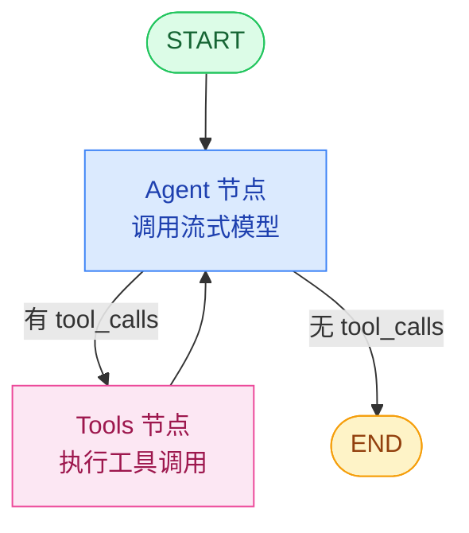

# Agent 工作流图

## 完整工作流（ReAct 模式）



## 节点说明

| 节点 | 职责 | 输入 | 输出 |
|------|------|------|------|
| `agent` | 调用流式模型，生成回复或决定调用工具 | messages（完整对话历史） | AIMessage（可能带 tool_calls） |
| `tools` | 执行 AI 调用的工具函数（查订单、查物流等） | AIMessage.tool_calls | ToolMessage 数组（工具执行结果） |

## 执行流程

ReAct（Reasoning + Acting）循环模式：

1. **Reasoning（思考）**：agent 节点接收消息，模型生成回复
2. **判断**：
   - 回复里有 `tool_calls` → 走 tools 节点
   - 回复里没有 `tool_calls` → 直接结束
3. **Acting（行动）**：tools 节点执行工具调用，返回结果
4. **循环**：工具结果返回给 agent，agent 基于结果继续思考/回复
5. **结束**：agent 给出最终答案，不再调用工具

```
用户提问
  ↓
agent: "好的，我来帮你查一下订单 ORD-001" → 调用 getOrder 工具
  ↓
tools: 执行 getOrder("ORD-001") → 返回订单状态
  ↓
agent: "您的订单状态是已发货，预计明天送达..." → 无工具调用
  ↓
结束
```

## 记忆体系

- **短期记忆**：PostgresSaver Checkpointer，按 `thread_id` 持久化
- 每次图执行自动加载/保存 messages
- 消息超阈值时自动裁剪（RemoveMessage）

## 流式输出

- **streamMode: `'custom'`**
- `agent` 节点内：流式生成时逐 token 推 `token` 事件
- `tools` 节点前后：推 `tool_start` / `tool_end` 事件
- 前端 SSE 接收，实现打字机效果 + 工具步骤实时展示
