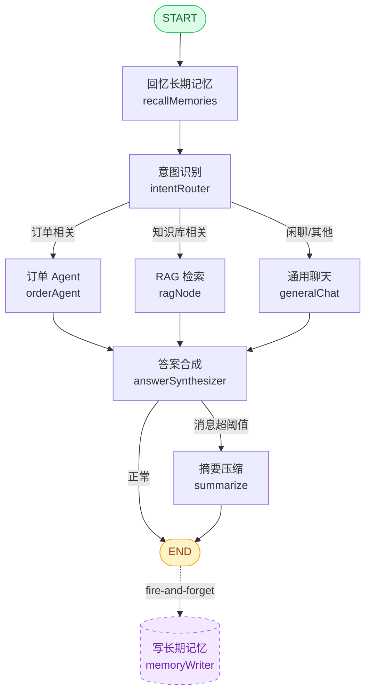

# Customer Graph 客服工作流图

## 完整工作流

## 节点说明

| 节点 | 职责 | 输入 | 输出 |
|------|------|------|------|
| `recallMemories` | 从 PostgresStore 召回用户长期记忆（偏好、历史等），注入 state | userInput | userMemories |
| `intentRouter` | 识别用户意图，路由到对应处理节点 | userInput, messages | intent（订单/知识库/闲聊） |
| `orderAgent` | 订单相关查询，调用工具查订单状态、物流等 | userInput, messages | orderResult |
| `ragNode` | 知识库检索，从 pgvector 查相关文档生成答案 | userInput, messages | ragAnswer, sources |
| `generalChat` | 通用闲聊，直接用模型回复 | userInput, messages | chatAnswer |
| `answerSynthesizer` | 合成最终答案，统一格式输出 | 各分支结果 | finalAnswer |
| `summarize` | 消息超阈值时，用 LLM 压缩旧对话为摘要，控制 Token | messages | summary, 裁剪后的 messages |

## 记忆体系

### 短期记忆（图内）
- **Checkpointer（PostgresSaver）**：按 `thread_id` 持久化对话状态
- 每次图执行自动加载/保存，刷新浏览器不丢对话
- `summarize` 节点负责摘要压缩，控制上下文长度

### 长期记忆（部分图内、部分图外）
- **召回（图内）**：`recallMemories` 节点从 PostgresStore 读取用户偏好，注入 prompt
- **写入（图外异步）**：图执行完后 fire-and-forget 调用 `memoryWriterNode`，不阻塞响应
- 按 `user_id` 命名空间存储，跨会话召回

## 流式输出

- **streamMode: `'updates'`**：节点级流式，每个节点执行完推送一次状态更新
- 前端可展示：意图识别结果 → 检索/工具进度 → 最终答案 的完整轨迹
